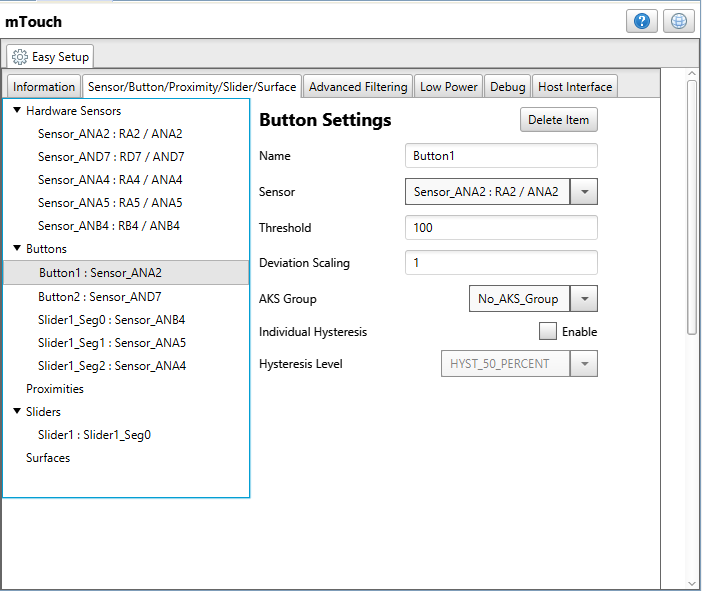
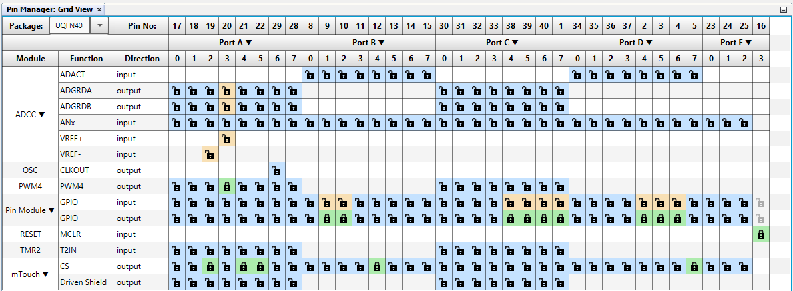

<!-- Please do not change this html logo with link -->

## DC Motor Control using Capacitive Touch Interface

## Introduction
  
The PIC18-Q10 family of microcontrollers (MCUs) is equipped with a 10-bit ADC with Computation (ADCC) and Hardware Capacitive Voltage Divider (CVD) technique for advanced capacitive touch sensing which are used to demonstrate this application demo. Along with these peripherals, the PIC18-Q10 family has a rich set of analog & digital peripherals, communication modules, and Core Independent Peripherals. This application demo discuss one of the simple and very useful real-time control application, DC motor control using capacitive touch Buttons and Slider.

### To see the DC Motor control with Capacitive Touch Interface demo operation video, click on the below image.

 

## Useful Links

- [PIC18F47Q10 Product Page](https://www.microchip.com/wwwproducts/en/PIC18F47Q10 "PIC18F47Q10 Product Page")
- [PIC18F47Q10 Code Examples on GitHub](https://github.com/microchip-pic-avr-examples?q=PIC18F47Q10&type=&language= "PIC18F47Q10 Code Examples on GitHub")
- [DC Motor Control with Touch Interface and IR Communication-Application Note](http://ww1.microchip.com/downloads/en/AppNotes/AN2933-DC-Motor-Control-with-Touch-Interface-and-IR00002933A.pdf "DC Motor Control with Touch Interface and IR Communications-Application Note")
- [mTouch® Capacitive Sensing Library Module for Mplab® X Code Configurator User’s Guide.](http://ww1.microchip.com/downloads/en/DeviceDoc/40001852A.pdf "mTouch® Capacitive Sensing Library Module for Mplab® X Code Configurator User’s Guide.")

## Description

In this application demo, Curiosity Nano base for click boards with PIC18F47Q10 Curiosity Nano board, QT7 Xplained Pro extension board for capacitive touch sensors, and DC motor 8 Click board to control the DC motor are used. This application demo demonstrates the usage of ADCC with hardware CVD technique and PWM peripherals of the PIC18F47Q10 MCU to control the DC motor with touch interface. For more details about CVD technique please refer to the application note AN1478: mTouch™ Sensing Solution Acquisition Methods Capacitive Voltage Divider available on Microchip website. The firmware libraries for this demo example is generated with the help of MPLAB® X Code Configurator (MCC) plugin available with MPLAB X IDE. For more details about how to set up a basic mTouch project please refer to [mTouch® Capacitive Sensing Library Module for Mplab® X Code Configurator User’s Guide.](http://ww1.microchip.com/downloads/en/DeviceDoc/40001852A.pdf "mTouch® Capacitive Sensing Library Module for Mplab® X Code Configurator User’s Guide"). 

## DC motor control using touch interface

To develop this application, the PIC18F47Q10 MCU is interfaced with QT7 Xplained Pro extension board and its analog pins are required to acquire the capacitive touch sensors data, which is analog in nature. The application demo used ADC computation feature along with CVD technique to acquire the capacitive touch sensors data. The QT7 Xplained Pro extension board has got two touch Buttons (Button1 and Button2) and one Slider (Slider1). Additionally, the board has got 8-LED's for touch detection indication. The DC Motor 8 click board from MikroElektronika is used to drive the DC motor. The DC Motor 8 click relies on the MIC4605, 85V half-bridge MOSFET driver with adaptive dead time and shoot-through protection, from Microchip. The DC Motor 8 click employs a boost converter made of MIC2206, a 2MHz boost regulator from Microchip. The click board can drive motors with up to 40V with an output current of up to 1amp. The PWM signal from MCU drives the motor while the EN pin used to enable the device is also routed to the mikroBUS™ CS pin. Logic HIGH on EN pin will set the MIC4605 to work in normal mode, while logic LOW on EN pin will put the MIC4605 into the power conservative shutdown mode. This pin is pulled HIGH with the on board resistor.Figure 1 shows the basic block diagram of the implementation of the application demo.

  
   Figure 1: Block diagram of DC motor control using touch interface 

## Software  Tools

- [MPLAB X IDE v5.40](https://www.microchip.com/mplab/mplab-x-ide "MPLAB X IDE v5.40")
- [XC8 Compiler v2.30](https://www.microchip.com/mplab/compilers "XC8 Compiler v2.20")
- [MPLAB Code Configurator](https://www.microchip.com/mplab/mplab-code-configurator "MPLAB Code Configurator")
- [PIC18F-Q_DFP v1.8.154](https://packs.download.microchip.com/ "PIC18F-Q_DFP v1.8.154")

***Note: For running the demo, the installed tool versions should be the same or later. This example is not tested with the previous versions.***

## Hardware used

- [PIC18F47Q10 Curiosity Nano](https://www.microchip.com/Developmenttools/ProductDetails/DM182029 "PIC18F47Q10 Curiosity Nano")
- [Curiosity Nano Base for Click boards](https://www.microchip.com/developmenttools/ProductDetails/AC164162 "Curiosity Nano Base for Click boards")
- [DC Motor 8 click]( https://www.mikroe.com/dc-motor-8-click "DC Motor 8 click")

## MCC settings

### System configuration

The System Module configuration window of MCC is used for MCU oscillator configuration, PLL, Watchdog timer and low voltage programming settings. In our application, high-frequency internal 32MHz Oscillator with clock divider 1 is used as the system clock and the watchdog timer is disabled. Figure 2 shows the system configuration settings used in this application.

  
   Figure 2: System Configuration  

### mTouch Configuration

mTouch® Capacitive Sensing Library Module from MCC is used for the touch interface implementation for Buttons and Slider.

1. To add Buttons, click on "Create New Button" icon/option and do the required configuration as shown in Figure 3.
2. Configure two Buttons as QT7 Xplained board has got two Buttons. And select corresponding pins for the Buttons as shown in Figure 4.

  
   Figure 3: Common button settings  

  
   Figure 4: mTouch Button setting  

3. To add Slider, click on "Create New Slider" icon/option and do the required configuration as shown in Figure 5.
4. Configure one Slider as QT7 Xplained board has got one Slider. And select corresponding pins for the Slider as shown in Figure 6.

  
   Figure 5: mTouch common Slider setting  

  
   Figure 6: mTouch Slider setting  

The overall hardware sensor setting and scan order are given in Figure 7 and Figure 8.

  
   Figure 7: mTouch Hardware Sensors Configuration  

***Note:*** Scan order for Slider should be sequential

  
   Figure 8: mTouch Sensor setting  

## TMR2 and PWM Configuraion

PWM4 peripheral along with Timer 2 is used for generating 40KHz PWM signal. The duty cycle of the PWM module is changed for controlling the speed of the DC motor. The Timer 2 module configuration is shown in Figure 9.

  
   Figure 9: Timer 2 Configuration 

The PWM4 module configuration is shown in Figure 10.

  
   Figure 10: PWM4 Configuration 

## Pin Mapping

The Pin Manager Grid View and PIN module windows of MCC shows the peripheral pin configuration used in the application. Refer Figure 11 and Figure 12 for peripheral pin configuration details.

  
   Figure 11: Pin Manager Grid View 

  
   Figure 12: PIN Module Configuration 

## Hardware setup

  
   Figure 13: Hardware setup 

Figure 13 shows the necessary connections between the development boards used for this application, it consists of QT7 Xplained Pro Extension board connected to Curiosity Nano Base for click boards, DC motor 8 click connected to mikroBUS slot 1 of Curiosity Nano Base for click board.

### Table 1. Connections Between QT7 Extension Pro and Curiosity Nano Base for click boards.

|S No. | Xplained Pro Extension Header Pin Names | Signal Name of Pins of PIC18F47Q10 | Pin No.of QT7 Header1 |Signal Name of Pins of QT7|IN/OUT Pin configuration of MCU|
|:---------:|:----------:|:-----------:|:---------:|:------------:|:------------:|	
| 1     | AN3	| RA2	| 4	| Y-LINE-1   |	IN   |
| 2     | RST2 	| RC7 	| 5 	| LED0       |  OUT  |
| 3     | RST3 	| RD5 	| 6	| LED6       |  OUT  |
| 4     | PWM2 	| RA4 	| 7	| Y-LINE-2   |	IN   |	
| 5     | PWM3 	| RA5	| 8	| Y-LINE-3   |	IN   |
| 6    	| INT2 	| RB4 	| 9	| Y-LINE-4   |  IN   |
| 7     | CS3  	| RD7 	| 10	| Y-LINE-0   |  IN   |
| 8     | SDA   | RB2   | 11    | LED7       |  OUT  |
| 9     | SCL   | RB1   | 12    | LED1       |  OUT  |
| 10    | CS2   | RD6   | 15    | LED2       |  OUT  |
| 11    | MOSI  | RC4   | 16    | LED3       |  OUT  |
| 12    | MISO  | RC5   | 17    | LED4       |  OUT  |
| 13    | SCK   | RC6   | 18    | LED5       |  OUT  |

## Operation

The application demonstrator demonstrate DC motor control using capacitive touch Buttons and a Slider. Start or stop the motor using touch Buttons and change the speed of the motor using Slider. In this application, the Buttons and Slider of QT7 Xplained Pro board are configured as explained below:

1. Touch Button1 to start the motor.
2. Touch Button2 to stop the running motor.
3. Slider to increase or decrease the motor speed.

After System Reset, all LEDs present on the QT7 Xplained Pro board are in OFF state and DC motor is turned OFF.

  
   Figure 14: DC motor is in the reset state  

Press Button1 to start the DC motor and run with pre-defined minimum speed. The Button1 indication LED turn ON to indicate the button press event. Also, the slider's lowest position LED turn ON to indicate start condition of the motor. 

  
   Figure 15: DC motor starts running with pre-defined speed 

Using Slider adjust speed of the DC motor. As you move finger from left to right on the Slider, the speed of the motor gradually increases and indication LEDs gradually turn ON.

  
   Figure 16: DC motor is runnning with moderate speed 

Once the finger reaches extreme right position on the Slider, the motor run at the highest speed and all the indication LEDs turn ON.

  
   Figure 17: DC motor is runnning with the highest speed 

As you move finger from right to left on the Slider, the speed of the motor gradually reduces and indication LEDs gradually turn OFF. Once the finger reaches extreme left position on the Slider, the speed of the motor reduces to zero and stop rotating.

  
   Figure 18: DC motor is runnning with the lowest speed 

Press Button2 to stall the motor. The Button2 indication LED turn ON to indicate the button press event. 

  
   Figure 19: DC motor is stalled  

## Conclusion

This application demo demonstrates the usage of important peripherals of PIC18-Q10 family of MCUs such as ADCC with CVD, PWM, and timer for simple real-time control applications. The combination of PWM and other core independent peripherals along with advanced analog peripherals such as ADCC with Hardware CVD available in PIC18FxxQ10 MCUs offer the lower system cost, low power, reliable and predictable application development. The Q10 family of MCUs can be used for a wide range of general purpose, low-power and, reliable, deterministic real-time control applications.

